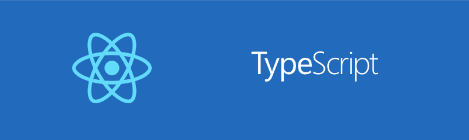

# 「React + TypeScript テキスト」サポートページ

## 開発環境の構築

* [インストール手順 Mac](install/mac.md)
* [インストール手順 Windows](install/windows.md)
* [VSCode 1.51.1 + React 17の問題対応](install/vscode1_51_1.md)

## コード

* [JSX](sources/jsx.md)
* [コンポーネント](sources/component.md)
* [コンポーネントの応用](sources/application.md)
* [テスティング](sources/test.md)
* [Redux](sources/redux.md)

## 演習問題の回答例

できるだけ自力で回答を考え、できた後に回答例は見てください。

* [ES6とTypeScript](answer/es6_ts.md)
* [JSX](answer/jsx.md)
* [コンポーネント](answer/component.md)
* [コンポーネントの応用](answer/application.md)
* [テスティング](answer/test.md)
* [Redux](answer/redux.md)
