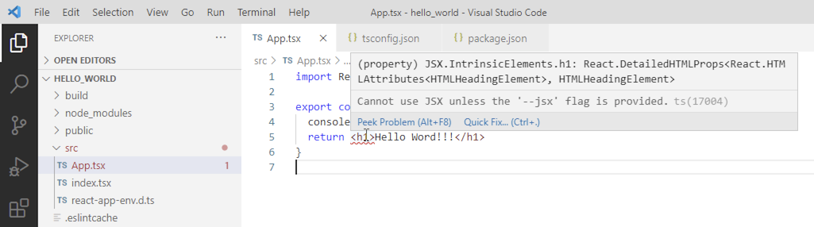
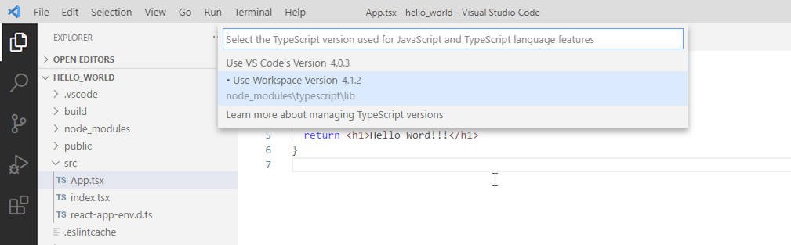

# VSCode 1.51.1 + React 17の問題対応

`npm start`を行った後でVSCodeを開くと以下のようにJSX部分にエラーが表示されます。

原因はVSCodeに含まれているTypeScriptのバージョン4.0.3と古いのが原因です。

近いうちに修正されるとは思いますが、暫定的にはVSCodeが使うTypeScriptをReactの作業ディレクトリーのものを使うように設定するればよいです。

**手順：**

CTRL(MacはCommand)+Shift+Pを押し `Select a TypeScript Version use for ....`を選択肢します。そこで表示される選択肢`Use workspace Version`を選択します。

[情報元はreddit](https://www.reddit.com/r/react/comments/k0bw7y/compileroptionsjsx_must_be_reactjsx_to_support/)